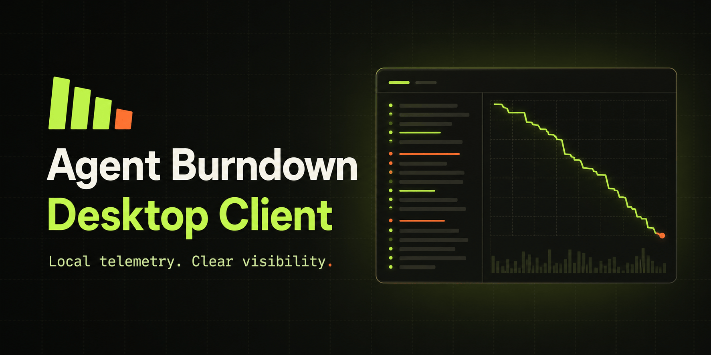

# burndown-cli

[](LICENSE)
[](https://go.dev/dl/)
[](#install)

Local telemetry collector for coding agents. It runs on your machine, receives
OTLP telemetry from Claude Code and Codex on `127.0.0.1:8765`, keeps only
metadata, and uploads that metadata to the Agent Burn Down backend at
`collector.agentburndown.com`.

Metadata-only by design: no prompt text, completion text, tool payloads, or file
contents ever leave your machine. See [Privacy](#privacy).

## Contents

- [How it works](#how-it-works)
- [Install](#install)
- [Quickstart](#quickstart)
- [Privacy](#privacy)
- [Commands](#commands)
- [Uninstall](#uninstall)
- [Troubleshooting](#troubleshooting)
- [License](#license)

## How it works

The collector runs as a background daemon. Its pipeline is:

```
Claude Code / Codex --OTLP--> receiver --> normalize --> filter --> queue --> uploader --> collector.agentburndown.com
                             (127.0.0.1:8765)         (metadata allowlist)  (~/.burndown/queue.db)
```

The receiver binds loopback only and refuses any non-loopback bind. Normalization
copies a fixed allowlist of metadata fields out of each event and drops
everything else. The queue is a local SQLite database that survives restarts and
network outages; the uploader drains it on the cadence set by the backend policy.
The daemon also builds revisioned session summaries from that same metadata
allowlist and uploads them idempotently; it never reads prompt or completion
content to do so.

An organization administrator may separately opt in to sanitized local
inventory. The collector learns that consent through heartbeat policy and only
then discovers display-safe Skill, Plugin, MCP, and context names/counts. It
uploads a replace-only snapshot at least every 12 hours. Disabled consent means
no discovery, retention, or inventory request; revocation cancels an in-flight
scan immediately. Paths, configuration and environment bodies, prompts,
credentials, raw schemas, and autonomy controls are never inventory fields.

## Install

macOS only. A Homebrew tap is not available yet — it is tracked in issue #14 and
is on hold pending Apple Developer ID signing.

### Prebuilt binary (recommended)

The installer selects the correct Apple silicon or Intel archive, verifies its
published checksum, and installs the CLI into the standard binary directory:

```
curl -fsSL https://github.com/agent-burn-down/desktop-client/releases/latest/download/install.sh | sh
```

Set `BURNDOWN_INSTALL_DIR` to choose another writable destination.

The binary is not notarized yet (issue #14). Fetching it with `curl` as shown
avoids Gatekeeper quarantine; if you download the tarball through a browser
instead, clear the flag with `xattr -d com.apple.quarantine burndown-cli` before
running it.

### Build from source

Requires Go 1.26 or newer and macOS.

```
git clone https://github.com/agent-burn-down/desktop-client.git
cd desktop-client
make build
cp bin/burndown-cli /usr/local/bin/
```

Confirm it runs:

```
burndown-cli --version
```

## Quickstart

A fresh machine goes from nothing to a running collector in five steps.

### 1. Get a collector key

Sign in to [app.agentburndown.com](https://app.agentburndown.com) and create a
collector key. It looks like `abd_...`.

### 2. Log in

`login` validates the key by registering this machine with the backend, then
stores the credentials in `~/.burndown/config.json` (file mode `0600`). With no
`--key` flag the key is read from a hidden prompt.

```
burndown-cli login
```

```
Reporting user email: you@example.com
Collector key (abd_...):
Logged in. key abd_a1b2c3d4… collector_id 1 machine your-hostname
```

You can pass the values as flags instead of being prompted:

```
burndown-cli login --email you@example.com --key abd_...
```

### 3. Configure your agents

`setup` detects Claude Code and Codex and adds the OTEL settings that point them
at the local collector. It only adds missing keys, preserves every existing
value, and backs up each file it touches with a timestamped copy first. A second
run is a no-op.

```
burndown-cli setup
```

```
Claude Code: detected (/Users/you/.claude)
Codex: detected (/Users/you/.codex)
Claude Code: will add
  CLAUDE_CODE_ENABLE_TELEMETRY=1
  OTEL_EXPORTER_OTLP_ENDPOINT=http://localhost:8765
  OTEL_EXPORTER_OTLP_PROTOCOL=http/json
  OTEL_METRICS_EXPORTER=otlp
  OTEL_LOGS_EXPORTER=otlp
  OTEL_LOG_TOOL_DETAILS=1
Codex: will add
  otel.environment = "control-center"
  otel.metrics_exporter = "none"
  otel.trace_exporter = "none"
  otel.log_user_prompt = false
  otel.exporter = { otlp-http = { endpoint = "http://127.0.0.1:8765/v1/logs", protocol = "json" } }
...
Claude Code: backed up to /Users/you/.claude/settings.json.json.bak.20260711-193038
Claude Code: updated
Codex: backed up to /Users/you/.codex/config.toml.toml.bak.20260711-193038
Codex: updated
Restart Claude Code and Codex so the new OTEL settings take effect.
```

Use `burndown-cli setup --check` for a dry run that prints pending changes and
exits non-zero if any are pending. Restart Claude Code and Codex afterward so
they pick up the new settings.

### 4. Install the background service

`service install` writes a launchd agent
(`~/Library/LaunchAgents/com.agentburndown.collector.plist`) that starts the
collector at login and restarts it if it crashes.

```
burndown-cli service install
burndown-cli service status
```

### 5. Verify

`doctor` checks version, config, backend reachability, heartbeat, the daemon,
agent OTEL setup, queue integrity, and the service. Each failing check prints a
one-line fix. Exit code is 0 (pass), 1 (warn), or 2 (fail).

```
burndown-cli doctor
```

```
[pass] version    running dev; no published releases yet
[pass] config     present, key set, permissions 0600/0700
[pass] backend    reachable at https://collector.agentburndown.com
[pass] heartbeat  ok (collector_id 1)
[pass] daemon     listening on 127.0.0.1:8765
[pass] agents     OTEL configured: Claude Code, Codex
[pass] queue      depth 0 (reported by daemon)
[pass] service    running (running (pid 51234))

overall: pass
```

Then run any agent command and confirm data arrives:

```
burndown-cli status
burndown-cli stats
```

## Privacy

The collector uploads metadata only. Free text never leaves your machine.

Every uploaded event is built from a fixed allowlist. The normalizer copies these
19 fields and nothing else:

| Field | Description |
|-------|-------------|
| `event_name` | Event type (for example `api_request`, `tool_result`) |
| `timestamp` | When the event occurred |
| `session_id` | Agent session or conversation id |
| `model` | Model slug |
| `tool_name` | Tool invoked |
| `mcp_server` | Display-safe MCP server identity |
| `mcp_tool` | Display-safe MCP tool identity |
| `mcp_server_tool_count` | Reported MCP server tool count |
| `mcp_schema_tokens` | Reported MCP schema token count |
| `skill_name` | Explicit display-safe Skill identity |
| `tool_success` | Whether the tool call succeeded |
| `tool_duration_ms` | Tool call duration |
| `cost_usd` | Reported cost |
| `input_tokens` | Prompt token count |
| `output_tokens` | Completion token count |
| `cache_read_tokens` | Cache-read token count |
| `cache_create_tokens` | Cache-write token count |
| `repo` | Privacy-safe repository or project-directory name |
| `error_message` | Error string, truncated to 2 KB |

`error_message` is the only free-text field that passes through, and it is capped
at 2 KB on a UTF-8 boundary so a misbehaving agent cannot stream large diagnostics
(or accidental prompt fragments) through it. No prompt text, no completion text,
no tool call arguments or results, and no file contents are ever read into an
uploaded event.

This is enforced by construction, not by policy: the normalizer names each field
it copies, so anything not on the list is impossible to include. Regression tests
and fuzz tests guard the allowlist against changes.

The local queue at `~/.burndown/queue.db` retains already-uploaded events for a
short window (default 7 days) so `burndown-cli stats` can show local usage; rows
older than the retention window are pruned automatically.

## Commands

| Command | Purpose |
|---------|---------|
| `login` | Register this machine with a collector key and save credentials |
| `register` | Re-register this machine and refresh collector id and policy |
| `setup` | Configure Claude Code and Codex to export telemetry to the collector |
| `serve` | Run the collector daemon (receiver, normalize, filter, queue, upload) |
| `service` | Manage the background service (`install`, `start`, `status`, `stop`, `uninstall`) |
| `status` | Show daemon state, counters, and configuration |
| `stats` | Show local daily tokens, cost, and top tools from retained events |
| `doctor` | Run health checks and print remediation hints |
| `send-test` | Post a synthetic OTLP log to the local receiver and confirm it queued |

Run any command with `--help` for its flags. `serve`, `status`, `send-test`, and
`doctor` accept `--port` (default `8765`). `status`, `stats`, and `doctor` accept
`--json` for machine-readable output.

## Uninstall

Remove the collector fully in three steps.

1. Remove the background service:

   ```
   burndown-cli service uninstall
   ```

   This boots out the launchd job and deletes
   `~/Library/LaunchAgents/com.agentburndown.collector.plist`.

2. Remove the local state, which includes the config file holding your collector
   key, the queue database, and the service logs:

   ```
   rm -rf ~/.burndown
   ```

3. Revert the agent configs. `setup` backed up each file it changed with a
   timestamped copy, so you can restore those, or remove the keys it added by
   hand.

   From `~/.claude/settings.json`, remove these keys from `env`:

   ```
   CLAUDE_CODE_ENABLE_TELEMETRY
   OTEL_EXPORTER_OTLP_ENDPOINT
   OTEL_EXPORTER_OTLP_PROTOCOL
   OTEL_METRICS_EXPORTER
   OTEL_LOGS_EXPORTER
   OTEL_LOG_TOOL_DETAILS
   ```

   From `~/.codex/config.toml`, remove these entries from `[otel]`:

   ```
   metrics_exporter
   trace_exporter
   log_user_prompt
   exporter
   ```

   Leave any keys you set yourself; `setup` only adds missing ones, so it never
   owns a value you already had. Restart Claude Code and Codex afterward.

## Troubleshooting

Run `burndown-cli doctor` first. It diagnoses most problems and prints a one-line
fix for each failing check.

**Daemon not running.** `status` reports `daemon: not running` or `doctor` fails
the daemon check. Start it:

```
burndown-cli service start
burndown-cli service status
```

If you are running it in the foreground instead of as a service, use
`burndown-cli serve`.

**Port 8765 already in use.** `serve` exits with `cannot bind 127.0.0.1:8765
(another burndown instance may be running)`. Either a collector is already
running (check `burndown-cli service status`) or another process holds the port.
Find it with `lsof -iTCP:8765 -sTCP:LISTEN`, or run the collector on another port
and point setup at it: `burndown-cli setup --port <port>` and
`burndown-cli serve --port <port>`.

**Key rejected.** `login` reports `collector key rejected`. The key is wrong or
revoked. Get a fresh key from the dashboard and run `burndown-cli login` again.

**Agent not detected.** `setup` skips an agent it does not detect. Force it with
`burndown-cli setup --claude`, `burndown-cli setup --codex`, or
`burndown-cli setup --all`.

**No data in the dashboard or stats.** Confirm the agents were restarted after
`setup`, then check counters with `burndown-cli status`: `received` should climb
as you use the agents, and `uploaded` should follow. `burndown-cli send-test`
posts a synthetic event to confirm the receiver-to-queue path works.

**Logs.** The service writes stdout and stderr to
`~/.burndown/logs/collector.out.log` and `~/.burndown/logs/collector.err.log`.

## License

[AGPL-3.0](LICENSE).
