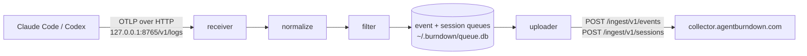

# Architecture

The collector is a single daemon (`burndown-cli serve`) with a linear pipeline.
Claude Code and Codex export OTLP telemetry to a loopback endpoint; the daemon
normalizes it to metadata, queues it durably, and uploads it to the backend.

## Stages

**receiver** — binds `127.0.0.1:8765` and accepts OTLP/HTTP log batches at
`/v1/logs`. It refuses to bind any non-loopback address, so telemetry never
leaves the machine unencrypted or reaches the network.

**normalize** — flattens each OTLP log record into a `NormalizedEvent` built from
a fixed metadata allowlist (see [Privacy](privacy.md)). Records without a usable
event name are dropped; free text is never copied.

For Codex logs, the daemon uses `conversation.id` to read only `id` and `cwd`
from the matching local `~/.codex/sessions/**/*.jsonl` or archived session file.
The latest `turn_context.payload.cwd` is preferred, Git worktrees are collapsed
to their common repository, and only the resulting repository name is attached
before queueing. Missing or unreadable session metadata leaves `repo` unset and
does not drop the event.

**filter** — drops events that are not worth uploading and enforces the metadata
contract before anything reaches the queue.

The session accumulator reads the complete normalized metadata batch immediately
before that noise filter. Token-bearing noise is uploaded only as aggregate
rollups, while the session summary retains its per-session token contribution;
the two totals therefore reconcile for telemetry observed by the daemon.

**queue** — a local SQLite database (`~/.burndown/queue.db`) that persists events
across restarts and network outages. Uploaded rows are retained for the
configured window (default 7 days) so `stats` can summarize local usage, then
pruned. The same database stores one revisioned, retry-safe metadata-only
snapshot per observed session.

**uploader** — drains the queue to `POST /ingest/v1/events` on the cadence set by
the backend policy (`flush_interval_seconds`, `max_batch_size`), which the daemon
refreshes on each heartbeat. It also uploads session snapshots to
`POST /ingest/v1/sessions`; revision-aware acknowledgements keep a newer local
snapshot pending if an older revision was in flight.

## Backend endpoints

| Endpoint | Purpose |
|----------|---------|
| `POST /ingest/v1/register` | Register the machine, resolve collector id, fetch policy |
| `POST /ingest/v1/heartbeat` | Liveness ping; refreshes policy |
| `POST /ingest/v1/events` | Upload a batch of normalized events |
| `POST /ingest/v1/sessions` | Upload idempotent structured session summaries |
| `GET /api/health` | Unauthenticated reachability check |

## Background service

On macOS the daemon runs under launchd. `service install` writes
`~/Library/LaunchAgents/com.agentburndown.collector.plist` with `RunAtLoad`
(start at login) and `KeepAlive` (restart on crash). The service runs
`burndown-cli serve` and writes stdout and stderr to
`~/.burndown/logs/collector.out.log` and `~/.burndown/logs/collector.err.log`.
